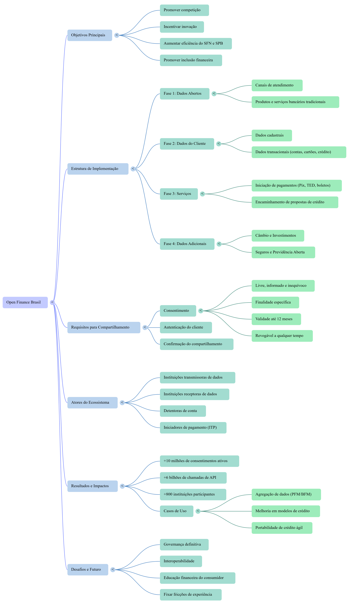

<div align="center">

# Bradesco - GenAI Dados Projeto 1


*Projeto do bootcamp DIO - Bradesco GenAI e Dados*

</div>

---

## Índice

- [Sobre o Projeto](#sobre-o-projeto)
- [O que foi feito](#o-que-foi-feito)
- [Guia Estratégico](#guia-estratégico)
- [Ferramentas utilizadas](#ferramentas-utilizadas)
- [Aprendizados](#aprendizados)
- [Estrutura do projeto](#estrutura-do-projeto)
- [Licença](#licença)
- [Autor](#autor)

---

## Sobre o Projeto

Este projeto faz parte do bootcamp **Bradesco – GenAI e Dados** da [DIO](https://www.dio.me/). O desafio propõe a criação de um caderno temático no NotebookLM, reunindo de três a cinco fontes abertas em texto ou PDF sobre um assunto financeiro introdutório.

A partir desse material, são definidos objetivos de estudo, elaboradas perguntas estratégicas e testadas variações de prompts, registrando as respostas e suas referências. O resultado esperado é um miniguia de estudo com resumos estruturados, glossário de conceitos e um conjunto de prompts reutilizáveis que apoiem futuras revisões.

A atividade enfatiza o uso da IA como ferramenta de aprendizagem ativa, aliando pensamento crítico, curadoria de fontes e organização do conhecimento.

---

## O que foi feito

### 1. Tema escolhido

| Item | Detalhe |
|------|---------|
| **Tema** | Open Finance / Open Banking |
| **Escopo** | Sistema financeiro aberto no Brasil: conceitos, regulamentação e benefícios |
| **Base regulatória** | Banco Central do Brasil (BCB) e Conselho Monetário Nacional (CMN) |

### 2. Fontes reunidas

Documentos oficiais utilizados como insumo para o caderno temático:

| # | Fonte | Orgão | Tipo |
|---|-------|-------|------|
| 1 | [Resolução Conjunta BCB/CMN nº 1/2020](fontes/01_BCB_CMN_Resolucao_Conjunta_1_2020_Implementacao_Open_Banking.pdf) | BCB / CMN | PDF |
| 2 | [Circular BCB nº 4.015/2020](fontes/02_BCB_Circular_4015_2020_Escopo_Dados_Servicos.pdf) | BCB | PDF |
| 3 | [Apresentação institucional – Open Finance](fontes/03_BCB_Apresentacao_Open_Finance_Brasil.pdf) | BCB | PDF |
| 4 | [FAQ Open Banking](fontes/04_BCB_FAQ_Open_Banking.pdf) | BCB | PDF |
| 5 | [Circular 4.015 – Exibe Normativo](https://www.bcb.gov.br/estabilidadefinanceira/exibenormativo?tipo=Circular&numero=4015) | BCB | Web |

### 3. Caderno NotebookLM

Material organizado e enviado ao NotebookLM para estudo ativo com IA: objetivos, perguntas estratégicas e variações de prompts.

> **[Acessar o caderno no NotebookLM](https://notebooklm.google.com/notebook/471491c8-347d-4bf9-a6f2-c080cb602b7c)**

### 4. Entregas

| # | Entrega | Descrição | Status |
|---|---------|-----------|--------|
| 1 | [Resumos](guia_estrategico_open_finance.md#parte-1-resumos-estruturados) | Conteúdo estruturado do material estudado | Concluído |
| 2 | [Glossário](guia_estrategico_open_finance.md#parte-2-glossário-de-conceitos-chave) | Conceitos principais definidos | Concluído |
| 3 | [Prompts](guia_estrategico_open_finance.md#parte-3-prompts-reutilizáveis-para-revisão) | Coleção reutilizável para revisões futuras | Concluído |
| 4 | [Infográfico](assets/infografico_open_finance.png) | Visualização gerada no NotebookLM | Concluído |
| 5 | [Mapa Mental](assets/mapa-mental.png) | Estrutura visual de conceitos gerada no NotebookLM | Concluído |

<div align="center">


*Infográfico gerado com o NotebookLM a partir das fontes oficiais do BCB/CMN.*



*Mapa mental gerado com o NotebookLM a partir das fontes oficiais do BCB/CMN.*

</div>

---

## Guia Estratégico

**[Guia Estratégico e Regulatório do Open Finance Brasil](guia_estrategico_open_finance.md)** — Miniguia de estudo gerado a partir do caderno no NotebookLM, contendo resumos estruturados, glossário de conceitos-chave e prompts reutilizáveis para revisão.

**[Apresentação Visual – Open Finance no Brasil](assets/Open_Finance_Brasil_Guia_Essencial.pdf)** — Apresentação gerada no NotebookLM com visão consolidada do conteúdo estudado.

---

## Ferramentas utilizadas

| Ferramenta | Finalidade |
|------------|------------|
| [Google NotebookLM](https://notebooklm.google.com/) | Caderno temático com IA para estudo ativo a partir das fontes |
| [GitHub](https://github.com/) | Versionamento e publicação do repositório do projeto |
| [VS Code](https://code.visualstudio.com/) | Edição dos arquivos Markdown e gestão do repositório |
| [GitHub Copilot](https://github.com/features/copilot) | Assistente de IA para estruturação e revisão do conteúdo |

---

## Aprendizados

Durante o desenvolvimento deste projeto, os principais aprendizados foram:

- **Curadoria de fontes** — Selecionar documentos oficiais de qualidade (BCB/CMN) e organizá-los de forma estruturada para consumo por IA.
- **Engenharia de prompts** — Elaborar perguntas estratégicas e variações de prompts que extraem respostas mais precisas e contextualizadas do NotebookLM.
- **IA como ferramenta de estudo** — Utilizar o NotebookLM não apenas para buscar respostas, mas como instrumento de aprendizagem ativa: gerar resumos, glossários, infográficos e mapas mentais a partir das fontes.
- **Organização do conhecimento** — Transformar conteúdo regulatório denso em material de estudo acessível, estruturado e reutilizável.
- **Documentação profissional** — Aplicar boas práticas de documentação em repositórios GitHub, com README bem estruturado, links internos e organização de pastas.

---

## Estrutura do projeto

```
├── assets/                              # Recursos visuais do projeto
│   ├── infografico_open_finance.png      # Infográfico gerado no NotebookLM
│   ├── mapa-mental.png                  # Mapa mental gerado no NotebookLM
│   └── Open_Finance_Brasil_Guia_Essencial.pdf  # Apresentação visual (NotebookLM)
├── fontes/                              # PDFs oficiais utilizados no NotebookLM
│   ├── README.md                        # Descrição das fontes
│   └── *.pdf                            # 4 documentos BCB/CMN
├── guia_estrategico_open_finance.md     # Miniguia de estudo (resumos + glossário + prompts)
└── README.md
```

---

## Licença

Este projeto está sob a licença [MIT](LICENSE). As fontes documentais pertencem ao Banco Central do Brasil (BCB) e ao Conselho Monetário Nacional (CMN) e são de domínio público.

---

## Autor

<div align="center">


### Luciano Marinho Silveira

Mestre em Administração | Gestão e Arquitetura Organizacional | Processos, Dados e Inovação | Inteligência Artificial

Juiz de Fora, MG, Brasil

[](https://github.com/lucianomjf14)
[](https://www.linkedin.com/in/luciano-marinho-silveira)
[](https://web.dio.me/users/lucianomjf14)
[](http://lattes.cnpq.br/8717991759915273)
[](mailto:lucianomjf14@gmail.com)

</div>
